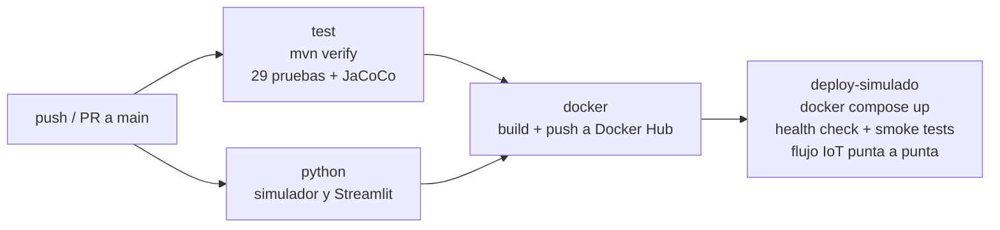

# U1: DevOps, contenedores y CI/CD

## Contenedores

**`Dockerfile` (multi-etapa)**
1. *Build*: `maven:3.9-eclipse-temurin-21` descarga dependencias en una capa aparte (cache) y empaqueta el jar.
2. *Runtime*: `eclipse-temurin:21-jre-jammy`, solo el JRE, con usuario no root `spring`. La carpeta `/app/uploads`
   pertenece a ese usuario para que la app pueda guardar comprobantes, fotos y las imágenes del asesor IA
   (antes el volumen quedaba como root y las subidas fallaban dentro del contenedor).

**`docker-compose.yml`**: la infraestructura completa como código.

| Servicio | Imagen | Rol |
|---|---|---|
| `mysql` | mysql:8.0 | Base de datos, con health check |
| `mosquitto` | eclipse-mosquitto:2.0 | Broker MQTT de los sensores (U3) |
| `app` | `barber-ia` (este repo) | Spring Boot, espera a que MySQL esté sano |
| `iot-simulador` | `iot/simulador` | Nodos IoT simulados (perfil `iot`) |
| `streamlit` | `ia/streamlit` | Laboratorio de prompts (perfil `ia`) |

## Pipeline (`.github/workflows/ci-cd.yml`)

1. **test**: compila, ejecuta las pruebas automatizadas con H2 en memoria y publica los reportes de Surefire y
   JaCoCo como artefactos. El resumen de pruebas y la cobertura aparecen en la página del run.
2. **python**: instala dependencias y compila el simulador IoT y la app Streamlit.
3. **docker**: construye la imagen con cache de GitHub Actions. En `main` la publica en Docker Hub con las
   etiquetas `latest` y el SHA del commit; en los PR solo la construye.
4. **deploy-simulado**: levanta MySQL, Mosquitto, la app y el simulador IoT con docker compose y verifica:
   - `/actuator/health` responde `UP`;
   - la página principal, el login y `/asesor-ia` responden;
   - la API del asesor IA devuelve una recomendación (modo demo);
   - un nodo IoT por HTTP con token recibe `201`, y el dashboard sin login redirige;
   - el simulador publica por MQTT y las lecturas llegan a la tabla `lecturas_iot` de MySQL.
   Al final apaga y borra el entorno.

**Secretos necesarios en GitHub** (Settings → Secrets → Actions): `DOCKERHUB_USERNAME` y `DOCKERHUB_TOKEN`.

## Pruebas automatizadas

| Clase | Qué prueba |
|---|---|
| `devops/HealthCheckTest` | health check público y login |
| `ia/PromptLibraryTest` | biblioteca de prompts: delimitadores, 0/1/4 ejemplos, plantillas |
| `ia/GeminiClientTest` | petición HTTP a Gemini (cabecera, imagen, JSON) con un servidor simulado |
| `ia/AsesorIAControllerTest` | modo demo, parseo de la respuesta, validaciones, aprobación con DNI |
| `iot/OcupacionCalculatorTest` | cálculo de ocupación, servicios y duración promedio |
| `iot/MonitoreoIotTest` | entrada HTTP con token, ruteo de tópicos MQTT, alertas, permisos del dashboard, badge en recepción |

## Otros ajustes de esta etapa

- `artifactId` corregido (`OpticaPrecisa` → `barberia-la-clasica`).
- Eliminada la dependencia `tess4j`, que no se usaba en el backend.
- Contraseña del admin inicial configurable con `ADMIN_PASSWORD`.
- `MAIL_HOST` de ejemplo corregido a `smtp.gmail.com`.
