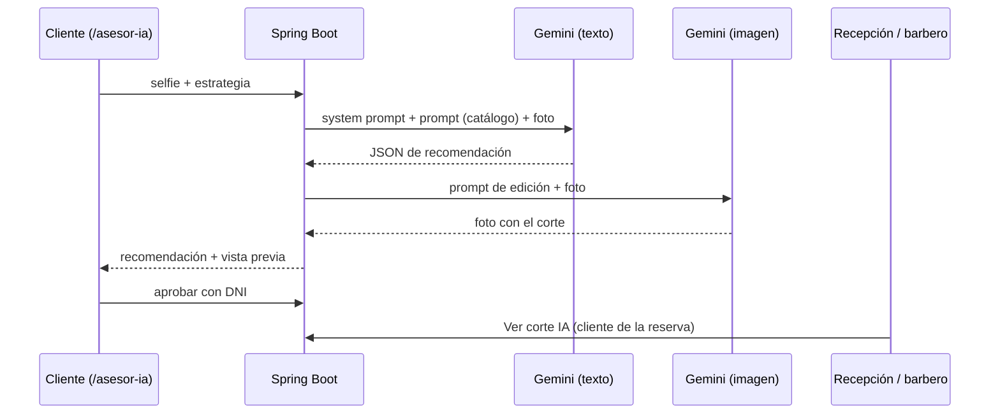

# U2: Inteligencia artificial y prompt engineering

## Qué hace

**Asesor de imagen** (propuesta 1 del Avance 01). El cliente sube una selfie en `/asesor-ia`:

1. Spring Boot envía la foto y el prompt a **Google Gemini** (`gemini-2.5-flash`) por HTTP.
2. El modelo devuelve un **JSON** con la forma del rostro, 3 cortes sugeridos con su motivo y semanas de
   mantenimiento, el corte recomendado y el servicio del catálogo de la barbería.
3. Con el corte recomendado, un segundo modelo (`gemini-2.5-flash-image`) **edita la foto** y genera la
   vista previa del cliente con su nuevo corte.
4. El cliente **aprueba con su DNI**. En recepción, la tarjeta de la silla con reserva muestra
   **"Ver corte IA"** para que el barbero vea la imagen aprobada.



Las semanas de mantenimiento quedan guardadas en `recomendaciones_ia.mantenimiento_semanas`; servirán
como dato de entrada del recordatorio predictivo de la U4.

## Componentes

| Archivo | Rol |
|---|---|
| `src/main/resources/prompts/*.txt` | Biblioteca de prompts versionada ([documentación](biblioteca-prompts.md)) |
| `service/PromptLibrary.java` | Carga y rellena las plantillas (`{{catalogo}}`, `{{corte}}`) |
| `service/GeminiClient.java` | Cliente REST de la API `generateContent` |
| `service/AsesorImagenService.java` | Orquesta el flujo, valida la imagen y guarda el resultado |
| `controller/AsesorIAController.java` | Página `/asesor-ia` y API `/api/ia/asesor` |
| `ia/streamlit/app.py` | Laboratorio para comparar zero, one y few-shot lado a lado |

## API

| Método | Ruta | Descripción |
|---|---|---|
| POST | `/api/ia/asesor` | `foto` (multipart, JPG/PNG/WEBP, máx. 5 MB), `estrategia` (`ZERO_SHOT`, `ONE_SHOT`, `FEW_SHOT`) |
| POST | `/api/ia/asesor/{id}/aprobar` | `dni` de 8 dígitos de un cliente registrado |
| GET | `/api/ia/cliente/{id}/ultima` | Último corte aprobado (solo administrador y secretario) |

## Configuración

| Variable | Valor por defecto |
|---|---|
| `GEMINI_API_KEY` | vacío: **modo demostración** con una respuesta fija, útil para CI y para probar sin clave |
| `GEMINI_MODEL` | `gemini-2.5-flash` |
| `GEMINI_IMAGE_MODEL` | `gemini-2.5-flash-image` |
| `GEMINI_PREVIEW_ENABLED` | `true` |

La clave se obtiene gratis en https://aistudio.google.com/apikey.

## Laboratorio de prompts (Streamlit)

```bash
pip install -r ia/streamlit/requirements.txt
streamlit run ia/streamlit/app.py          # backend en http://localhost:8080
# o con Docker: docker compose --profile ia up -d  ->  http://localhost:8501
```

Permite subir una foto y ver, en columnas, la respuesta y la latencia de cada estrategia, además de
leer los archivos de la biblioteca de prompts.

## Seguridad y privacidad

- Solo se aceptan imágenes de hasta 5 MB.
- El prompt prohíbe opinar sobre atractivo, peso, edad, etnia o piel.
- Si la foto no muestra un rostro, el modelo responde `rostroDetectado: false` y no se genera imagen.
- Las fotos se guardan en `uploads/ia/` (volumen de Docker), fuera del repositorio.
