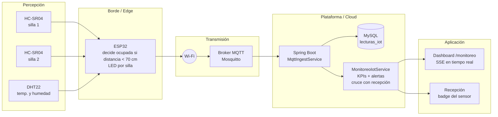
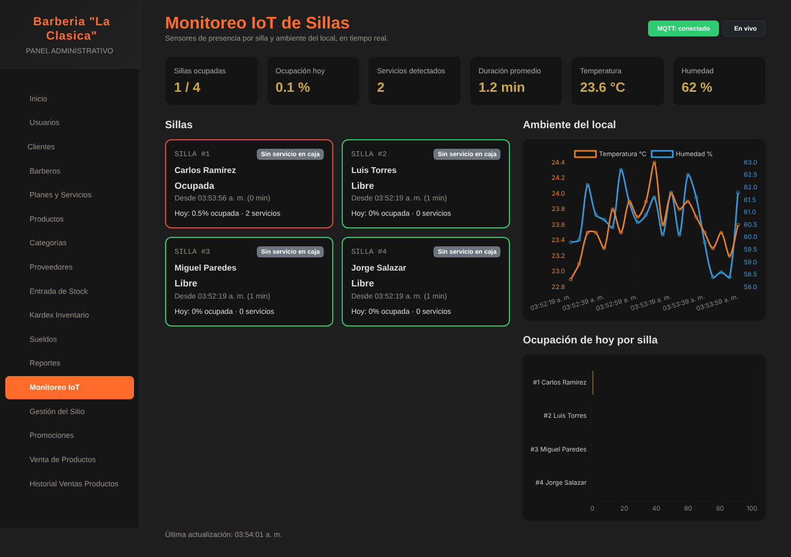

# U3: Internet de las Cosas, monitoreo de sillas

## Problema que resuelve

Recepción registra a mano cuándo empieza y termina cada servicio. No hay forma de saber si una silla
se ocupó **sin registrar el servicio en caja** (ingreso que se pierde), si una cuenta quedó abierta con la
silla vacía, cuánto dura de verdad un corte ni qué tan ocupado está cada barbero. Además, el confort del
local (calor y humedad en Chiclayo) afecta la experiencia del cliente.

## Arquitectura por capas



| Capa | Tecnología | Detalle |
|---|---|---|
| Percepción | HC-SR04 (ultrasonido) por silla, DHT22 | Nodo ESP32 en Wokwi (`iot/wokwi`) o simulador Python (`iot/simulador`) |
| Edge | ESP32 | Convierte la distancia en ocupada/libre y solo publica cuando cambia (más un latido cada 20 s), lo que reduce tráfico |
| Red | Wi-Fi | |
| Protocolo | **MQTT** (QoS 1); HTTP como alternativa | MQTT es liviano y de publicación/suscripción, ideal para sensores. La entrada HTTP con token sirve para nodos sin cliente MQTT |
| Plataforma | Mosquitto + Spring Boot + MySQL | Ingesta, persistencia y reglas de negocio |
| Aplicación | Dashboard web con Chart.js y Server-Sent Events | Se actualiza solo, sin recargar la página |

## Tópicos y mensajes

| Tópico | Ejemplo de payload |
|---|---|
| `laclasica/sillas/{id}/estado` | `{"ocupada": true, "distanciaCm": 41.3, "dispositivo": "esp32-sillas"}` |
| `laclasica/ambiente` | `{"temperatura": 24.6, "humedad": 58.2, "dispositivo": "esp32-sillas"}` |

`{id}` es el número de silla, igual al id del barbero que muestra recepción como "SILLA #id".
El prefijo se cambia con `MQTT_TOPIC_PREFIX`.

Entrada HTTP equivalente: `POST /api/iot/sillas/{id}` y `POST /api/iot/ambiente` con la cabecera
`X-IOT-TOKEN` igual a `IOT_HTTP_TOKEN`.

## Dashboard (`/monitoreo`, administrador y secretario)



- **KPIs**: sillas ocupadas ahora, ocupación promedio del día, servicios detectados, duración promedio
  del servicio, temperatura y humedad.
- **Tarjeta por silla**: estado del sensor (ocupada, libre o sin señal), desde cuándo, y si recepción tiene
  un servicio abierto en caja para ese barbero.
- **Gráficos**: temperatura y humedad recientes; porcentaje del día que estuvo ocupada cada silla.
- **Alertas** (umbrales en `application.properties`):
  - silla ocupada hace más de 5 min **sin servicio registrado en caja** (posible ingreso no registrado);
  - cuenta abierta en caja con la silla vacía hace más de 10 min;
  - servicio de más de 60 min;
  - temperatura sobre 28 °C o humedad sobre 70 %.
- En **Recepción Sillas**, cada tarjeta muestra además un badge con el estado del sensor.

## Cómo ejecutarlo

**Opción A: todo con Docker (simulador incluido)**

```bash
docker compose --profile iot up -d --build
```

El simulador publica 4 sillas (`IOT_SILLAS=1,2,3,4`). Con `IOT_ESCALA_TIEMPO=10` un corte de 30 min dura
3 min reales, para que la demostración muestre movimiento. Usa `1` para tiempo real.

**Opción B: ESP32 en Wokwi**

1. Crea un proyecto ESP32 en https://wokwi.com y copia `iot/wokwi/sketch.ino`, `diagram.json` y `libraries.txt`.
2. Inicia la simulación. Mueve el control de distancia de cada HC-SR04 (menos de 70 cm = silla ocupada)
   y la temperatura del DHT22.
3. Wokwi solo llega a brokers públicos, así que el sistema debe escuchar el mismo broker:
   `MQTT_BROKER_URL=tcp://broker.hivemq.com:1883`. En un broker público conviene usar un prefijo propio
   (por ejemplo `laclasica-grupo3`) tanto en el sketch (`PREFIJO`) como en `MQTT_TOPIC_PREFIX`.

**Opción C: simulador sin Docker**

```bash
pip install -r iot/simulador/requirements.txt
MQTT_HOST=localhost python iot/simulador/simulador.py
# por HTTP en vez de MQTT:
MODO=http IOT_HTTP_TOKEN=mi-token python iot/simulador/simulador.py
```

## Datos guardados

Tabla `lecturas_iot`: `tipo` (SILLA o AMBIENTE), `silla_id`, `ocupada`, `distancia_cm`, `temperatura`,
`humedad`, `dispositivo`, `canal` (MQTT o HTTP) y `fecha`. Los KPIs se recalculan desde esta tabla, así que
el historial queda disponible para reportes.
